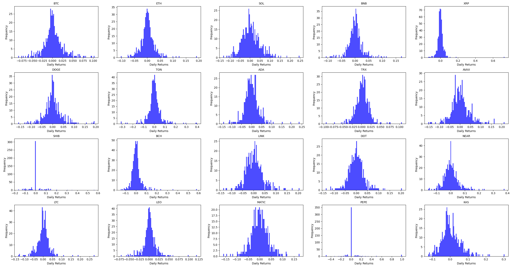
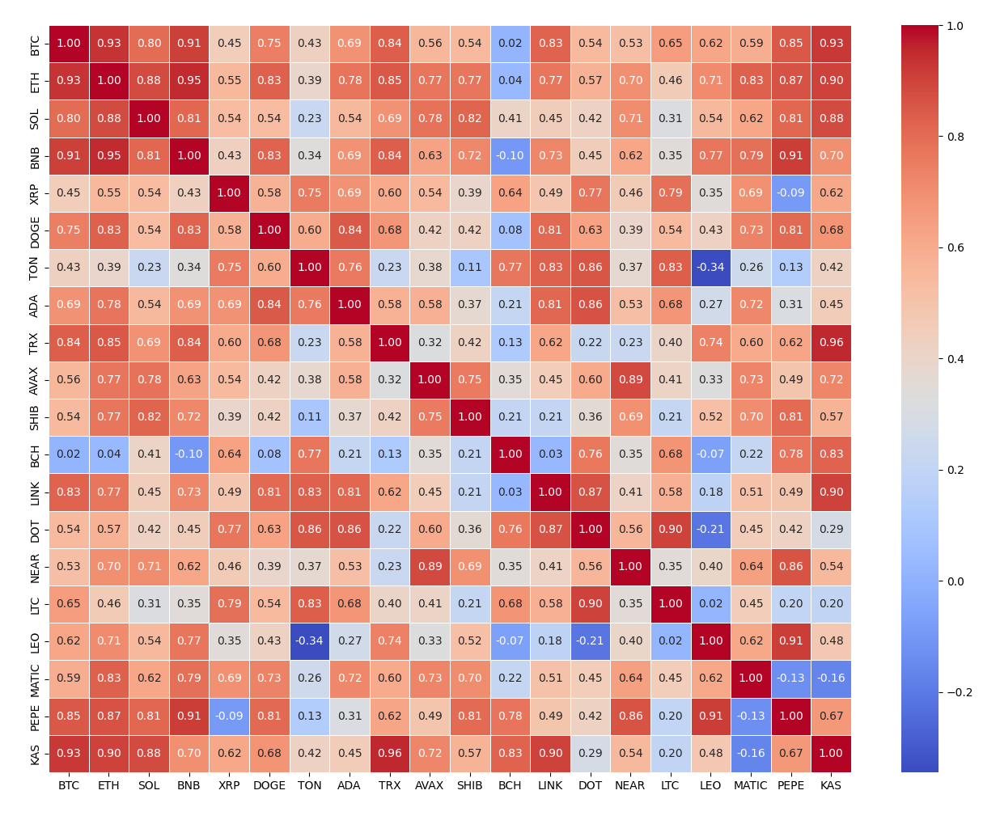
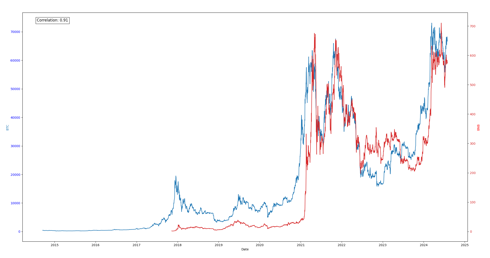

# Cryptocurrency Index Alternatives

## Rivin and Scevola's [CCI30 index](https://cci30.com)

As described in the original [white paper](https://cci30.com/wp-content/uploads/2018/04/CCi30_index_paper.pdf), the CCI30 cryptocurrency index is intended for two main purposes:

1. A barometer to monitor the cryptocurrency market
2. A passive investment vehicle for invetsors to participate in the growth of the cryptocurrency market

Rivin and Scevola compute the weights of the index by using a smoothed version of the float-adjusted market cap (FMC). They use an exponential moving average of this figure to account for high volatility in the crypto market.

## Alternative Approaches

Similar to the CCI30 approach, I pull data from the top cryptocurrencies (not necessarily 20) by market cap excluding stablecoins which are pegged to traditional fiat currencies (e.g. Dai or USDt).

I recompute the weights using **two different approaches**:

1. Combining FMC and historical price volatility into the weighting process
2. Combining FMC and frequency of near-zero returns to weigh down hype-driven altcoins

The idea behind these approaches is to provide a more **accurate benchmark for stable growth** by limiting (but not surpressing) exposure to high-market-cap and volatile altcoins.

All data used is pulled in real time from the [CoinMarketCap](https://coinmarketcap.com/) and [YFinance](https://finance.yahoo.com/) APIs.

<br>

### Volatility-weighting

The intuition behind this calculation is to account for coin volatility not by smoothing the market cap, but by examining historical price volatility (intraday and overnight) and incorporating this measure into the formula.

I include two ways of calculating a volatility score: traditional close-to-close volatility and the Yang Zhang historical volatility estimator. See alternatives methods of [measuring historical volatility](https://dynamiproject.wordpress.com/wp-content/uploads/2016/01/measuring_historic_volatility.pdf).

<br>

The **Close-to-Close Volatility** for time $t$ is calculated as follows:

<br>

Given the closing prices $c_t$ on day $t$, the squared log return is defined by:

$$
\text{Squared Log Return} = \left( \log \left( \frac{C_t}{C_{t-1}} \right) \right)^2
$$

Thus, the **Close-to-Close Volatility** is:

$$
\sigma_{C-C}^2 = \frac{1}{n-1} \sum_{t=1}^{n} \left( \log \left( \frac{C_t}{C_{t-1}} \right) \right)^2
$$

where $n$ is the number of days in the sample period.

<br>

Alternatively, for $n$ days in the sample period and $T$ trading periods in the year, the **Yang-Zhang volatility** is given by:

$$
\sigma_{Yang-Zhang} = \sqrt{\sigma_{O-C}^2 + k \cdot \sigma_{RS}^2 + (1 - k) \cdot \sigma_{OC}^2} \times \sqrt{T}
$$

Where:

$$
\sigma_{OC}^2 = \frac{1}{n-1} \sum_{i=1}^{n} \left[ \log \left( \frac{O_i}{C_{i-1}} \right) \right]^2 \quad \text{(Overnight Volatility)}
$$

$$
\sigma_{O-C}^2 = \frac{1}{n-1} \sum_{i=1}^{n} \left[ \log \left( \frac{C_i}{O_i} \right) \right]^2 \quad \text{(Open-to-Close Volatility)}
$$

$$
\sigma_{RS}^2 = \frac{1}{n-1} \sum_{i=1}^{n} \left[ \log \left( \frac{H_i}{O_i} \right) \cdot \left( \log \left( \frac{H_i}{O_i} \right) - \log \left( \frac{C_i}{O_i} \right) \right) + \log \left( \frac{L_i}{O_i} \right) \cdot \left( \log \left( \frac{L_i}{O_i} \right) - \log \left( \frac{C_i}{O_i} \right) \right) \right] \quad \text{(Rogers-Satchell Volatility)}
$$

$$
k = \frac{0.34}{1.34 + \frac{n+1}{n-1}}
$$

Both methods give similar results and a similar ranking when the weights are computed. 

All credit for the code used to calculate these scores goes to Jason Strimpel's [Volatility Trading Repository](https://github.com/jasonstrimpel/volatility-trading.git).

<br>

Final weight for each coin $i$ is computed using the square root of the **inverse average mean volatility** multiplied by the **market cap at time $t$**:

$$
\text{Weighted Value} \quad W_i = \sqrt{\frac{1}{\bar{\sigma}_i} \cdot M_i(t)}
$$

For each coin, the weight at time $t$ is then given by:

$`
\text{W}_i(t) = \frac{\text{W}_i(t)}{\displaystyle\sum_{j=1}^{n} \text{W}_j(t)}
`$

<br>

### Measuring near-zero returns

The second approach aims to **filter out inconsistent and volatile growth** (i.e. sudden short-term price spikes) to weigh down altcoins with abnormally large market caps and high volatility. 

Below is a plot of the daily returns of the **top 20 cryptocurrencies by market cap**:

<br>



<br>

We can easily observe that stable coins, on top of being relatively normally distributed, experience less volatility in daily returns, while volatile altcoins exhibit **high frequencies of near-zero daily returns**.

The **frequency of near-zero returns for each cryptocurrency** is calculated as follows:

$`
\text{Near-Zero Return Frequency}_i = \frac{\displaystyle\sum_{t=1}^{T} \chi_{[-\tau, \tau]}(R_{i,t})}{T} \times 100
`$

Where:

- $R_{i,t}$ is the return of coin $i$ at time $t$
- $T$ is the total number of returns for coin $i$
- $\tau$ is the near-zero threshold (set to $\pm$ 0.1% in the code)
- $\chi_{[-\tau, \tau]}(R_{i,t})$ is an indicator function that is equal to $1$ if $R_{i,t}$ is within the interval, $0$ otherwise

<br>

Final weight for each coin is computed using the square root of the **inverse near-zero return frequency** multiplied by the **market cap at time $t$**:

$$
\text{Inverse Near-Zero Return Frequency}_i = \frac{1}{\text{Near Zero Return Frequency}_i}
$$

$$
\text{W}_i(t) = \sqrt{\text{Market Cap}_i(t) \times \text{Inverse Near-Zero Return Frequency}_i(t)}
$$

For each coin, the weight at time $t$ is then given by:

$`
\text{W}_i(t) = \frac{\text{W}_i(t)}{\displaystyle\sum_{j=1}^{n} \text{W}_j(t)}
`$

<br>

## Correlations

Repository also includes some work done on **pariwise correlations between coins** over time:





<br>

## Example Usage

Here is an example fetching top 20 coins by market cap and computing their respective weights in our index by both approaches.

### Getting coin data and sorting appropriately:

```python
import pandas as pd
import yfinance as yf
import os
import requests

from dotenv import load_dotenv

load_dotenv()

API_KEY = os.getenv("API_KEY")
url = 'https://pro-api.coinmarketcap.com/v1/cryptocurrency/listings/latest'

headers = {
    'Accepts': 'application/json',
    'X-CMC_PRO_API_KEY': API_KEY,
}

# set parameters to get top 20 coins
parameters = {
    'start': '1',
    'limit': '23',
    'convert': 'USD'
}

# pull data from yfinance API
response = requests.get(url, headers = headers, params = parameters)
call = response.json()

coins = []
market_caps = []

# manually exclude stable coins and override unusual name changes
stablecoins = {'Tether USDt', 'USDC', 'Dai', 'FDUSD', 'USDD'}

manual_overrides = {
    'PEPE': 'PEPE24478-USD',
    'APT': 'APT21794-USD',
    'MNT': 'MNT27075-USD',
    'RENDER': 'RNDR-USD',
    'ARB': 'ARB11841-USD'
}

for crypto in call['data']:
    symbol = crypto['symbol']
    name = crypto['name']
    market_cap = crypto['quote']['USD']['market_cap']
    
    if name not in stablecoins:
        coins.append(symbol)
        market_caps.append(market_cap)

prices_df = pd.DataFrame()

market_cap_df = pd.DataFrame({'Symbol': coins, 'Market Cap': market_caps}).set_index('Symbol')

# initialise dictionary with OHLC data for each coin (required for volatility weighting approach)
coins_data = {}
period = 'max'

for coin in coins:
    if coin in manual_overrides:
        yf_symbol = manual_overrides[coin]
    else:
        yf_symbol = coin + '-USD'
    
    try:
        price_data = yf.download(yf_symbol, period = period, interval = '1d')

        coins_data[coin] = price_data[['Open', 'High', 'Low', 'Close']]
    
    except Exception as e:
        print(f"Error fetching data for {coin}: {e}")

# initialise empty DataFrame with close data for each coin (for near-zero returns approach)
coins_close = pd.DataFrame()

for coin in coins:
    if coin in manual_overrides:
        yf_symbol = manual_overrides[coin]
    else:
        yf_symbol = coin + '-USD'
    
    try:
        coin_close = yf.download(yf_symbol, period = period, interval = '1d')
        if coin_close.empty:
            print(f"No data for {yf_symbol}. Skipping.")
            
            continue

        coins_close[coin] = coin_close['Close']
   
    except Exception as e:
        print(f"Error fetching data for {yf_symbol}: {e}. Skipping.")
```

<br>

### Computing weighted values

**For volatility approach, using Yang Zhang volatility estimator:**

```python
import math
import numpy as np

from data.coins import coins_data

# function to calculate Yang Zhang volatility estimator
def yang_zhang(price_data, window = 30, trading_periods = 365, clean = True):

    log_h = (price_data['High'] / price_data['Open']).apply(np.log)
    log_l = (price_data['Low'] / price_data['Open']).apply(np.log)
    log_c = (price_data['Close'] / price_data['Open']).apply(np.log)
    
    log_oc = (price_data['Open'] / price_data['Close'].shift(1)).apply(np.log)
    log_oc_sq = log_oc ** 2
    
    log_cc = (price_data['Close'] / price_data['Close'].shift(1)).apply(np.log)
    log_cc_sq = log_cc ** 2
    
    rs = log_h * (log_h - log_c) + log_l * (log_l - log_c)
    
    close_vol = log_cc_sq.rolling(
        window = window,
        center = False
    ).sum() * (1.0 / (window - 1.0))
    
    open_vol = log_oc_sq.rolling(
        window = window,
        center = False
    ).sum() * (1.0 / (window - 1.0))
    
    window_rs = rs.rolling(
        window = window,
        center = False
    ).sum() * (1.0 / (window - 1.0))

    k = 0.34 / (1.34 + (window + 1) / (window - 1))
    result = (open_vol + k * close_vol + (1 - k) * window_rs).apply(np.sqrt) * math.sqrt(trading_periods)

    if clean:
        return result.dropna()
    else:
        return result

# initialize emtpty dictionary with volatility time series for each coin
volatilities2 = {}

for coin, data in coins_data.items():
    volatility = yang_zhang(data)
    volatilities2[coin] = volatility
```

<br>

**For near-zero returns approach:**

```python
import pandas as pd
import numpy as np
import sys
import os

sys.path.append(os.path.dirname(os.path.dirname(os.path.abspath(__file__))))

from data.coins import coins_close

daily_returns_df = coins_close.pct_change()
daily_returns_df = daily_returns_df.replace([np.inf, -np.inf], np.nan).dropna()

# set threshold for near zero returns to 0.1%
near_zero_threshold = 0.001

# compute frequency of near-zero returns in a coin's close price and store in dictionary
def calculate_near_zero_return_frequency(returns_df, threshold):
    near_zero_return_freq = {}

    for coin in returns_df.columns:
        returns = returns_df[coin]
        near_zero_count = ((returns >= -threshold) & (returns <= threshold)).sum()
        total_count = returns.count()
        near_zero_return_freq[coin] = (near_zero_count / total_count) * 100

    return pd.DataFrame.from_dict(near_zero_return_freq, orient = 'index', columns = ['Near Zero Return Frequency'])

near_zero_returns_df = calculate_near_zero_return_frequency(daily_returns_df, near_zero_threshold)
```

<br>

### Computing final weights

**Volatility weights:**

```python
import pandas as pd
import numpy as np
import sys
import os

sys.path.append(os.path.dirname(os.path.dirname(os.path.abspath(__file__))))

from data.coins import market_cap_df
from volatility_weighting.close_to_close import volatilities1
from volatility_weighting.YangZhang import volatilities2

# compute necessary averages
average_volatilities = {coin: volatility.mean() for coin, volatility in volatilities2.items()}
average_volatility_df = pd.DataFrame(list(average_volatilities.items()), columns = ['Symbol', 'Average Volatility']).set_index('Symbol')
inverse_average_volatility = 1 / average_volatility_df['Average Volatility']

# return weights
weighted_values = np.sqrt(inverse_average_volatility * market_cap_df['Market Cap'])
weights = (weighted_values / weighted_values.sum())
weights_df = pd.DataFrame(weights, columns = ['Weight'])
weights_df_sorted1 = weights_df.sort_values(by = 'Weight', ascending = False)
```

<br>

**Near-zero returns (NZR) weights:**

```python
import pandas as pd
import numpy as np
import sys
import os

sys.path.append(os.path.dirname(os.path.dirname(os.path.abspath(__file__))))

from data.coins import market_cap_df
from consistent_returns.memecoins import near_zero_returns_df

inverse_near_zero = 1 / near_zero_returns_df

weighted_values = np.sqrt(market_cap_df['Market Cap'] * inverse_near_zero['Near Zero Return Frequency'])

weights = (weighted_values / weighted_values.sum())
weights_df = pd.DataFrame(weights, columns = ['Weight'])
weights_df_sorted2 = weights_df.sort_values(by = 'Weight', ascending = False)
```

<br>

On 01/08/2024, the two approaches give the **following weights for an index consisting of 20 coins**: 

<br>

| Weight Rank | Symbol | Weight (Volatility Approach) | Weight (NZR Approach) | Weight Rank |
|:---:|:--------:|:-------:|:-------:|:----:|
|1| BTC    | 0.344457 | 0.274516 |1|
|2| ETH    | 0.166885 | 0.138988 |2|
|3|BNB    | 0.073690 | 0.077968 |4|
|4| SOL    | 0.060417 | 0.092683 |3|
|5| XRP    | 0.045404 | 0.050736 |6
|6| DOGE   | 0.030204 | 0.032527 |9|
|7| ADA    | 0.027776 | 0.034127 |8|
|8| TRX    | 0.026030 | 0.024558 |12|
|9| TON    | 0.023561 | 0.050740 |5|
|10| LEO    | 0.023353 | 0.011527 |18|
|11| BCH    | 0.022074 | 0.022116 |15|
|12| AVAX   | 0.021946 | 0.037389 |7|
|13| DOT    | 0.021172 | 0.024093 |13|
|14| LINK   | 0.019337 | 0.027440 |11|
|15| SHIB   | 0.019297 | 0.006177 |19|
|16| LTC    | 0.018683 | 0.018058 |17|
|17| NEAR   | 0.015770 | 0.018208 |16|
|18| MATIC  | 0.015097 | 0.022720 |14|
|19| KAS    | 0.013165 | 0.031359 |10|
|20| PEPE   | 0.011682 | 0.004067 |20|


